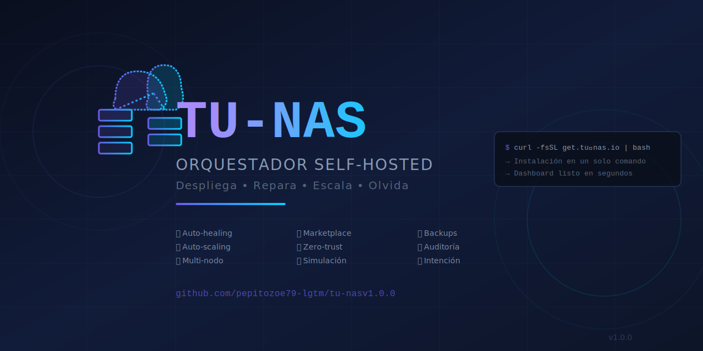

# 🌌 tu-nas: El Orquestador Cloud Self-Hosted



**tu-nas** es una plataforma de orquestación de próxima generación diseñada para convertir cualquier servidor Linux en una nube privada potente, estética y automatizada. Con un enfoque en la simplicidad "un clic" y una estética **Cyber-Cloud** premium.

---

## 🚀 Novedades de la Versión v1.0.0

### 🎨 Interfaz de Usuario "State-of-the-Art"
- **Estética Glassmorphism**: Panel de control moderno construido con Nuxt 3 y Vuetify, utilizando efectos de cristal esmerilado y degradados vibrantes.
- **Dashboard Dinámico**: Visualización en tiempo real del estado de tus nodos, contenedores activos y consumo de recursos.
- **Experiencia Adaptativa**: Diseño totalmente responsivo que se ve increíble en cualquier dispositivo.

### 🛍️ App Marketplace (Inspirado en CasaOS)
- **Catálogo Expandido**: +17 aplicaciones listas para instalar con un solo clic.
- **Categorías Inteligentes**: Media (Jellyfin, Plex, Emby), Cloud (Nextcloud, Transmission), Red (AdGuard, Pi-hole) y Herramientas (Portainer, Uptime Kuma).
- **Auto-Proxy**: Configuración automática de dominios locales (ej: `jellyfin.tu-nas.local`) para cada aplicación instalada.

### 🔐 Gestión de Seguridad y Usuarios
- **Nuevo Gestor de Usuarios**: Sección dedicada para añadir, editar y eliminar accesos al sistema.
- **Roles Definidos**: Soporte para administradores y usuarios estándar.
- **Autenticación Centralizada**: Acceso protegido mediante login oficial (`admin` / `tu-nas-2024`).

### 🛠️ Arquitectura y Despliegue
- **Instalador de una línea**: Despliegue completo en cualquier Linux mediante un script Bash automatizado.
- **Multi-Contenedor**: Arquitectura robusta basada en Docker (Manager, Agent, UI, Nginx Proxy).
- **Auto-Healing**: Sistema diseñado para monitorizar y recuperar servicios automáticamente.

---

## 🛠️ Instalación Rápida (Linux)

Para desplegar **tu-nas** en tu servidor, simplemente ejecuta:

```bash
curl -fsSL "https://raw.githubusercontent.com/pepitozoe79-lgtm/tu-nasv1.0.0/main/scripts/install.sh" | sudo bash
```

---

## 🏗️ Estructura del Proyecto

- `/ui`: Interfaz Nuxt 3 con diseño premium.
- `/manager`: Backend central en Node.js para la gestión de la infraestructura.
- `/agent`: Agente ligero para monitoreo de nodos remotos.
- `/proxy`: Sistema de enrutamiento dinámico basado en Nginx.

---

## 🤝 Créditos y Mentores
Proyecto desarrollado con el objetivo de democratizar la gestión de servidores domésticos.
**Inspiración**: CasaOS / CloudPanel.

---
*Desarrollado con ❤️ para la comunidad Self-Hosted.*
